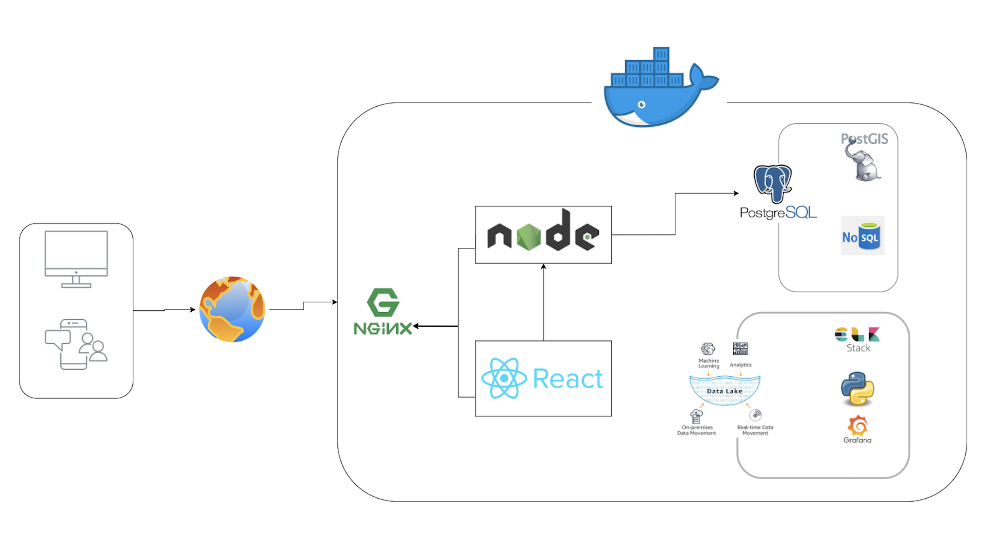

# InstaStore
Technical test for back-end and full-stack developers.
 - [Instructions](#instructions)
 - [Requirements](#requirements)
 - [Improvements and trade offs](#improvements-and-trade-offs)
 
## Instructions
 1. Fork this repo.
 2. Create a new branch.
 3. Understand the functional and non-functional requirements.
 4. Ask any questions to david.camargo@instaleap.io. (you have 1 chance, make it worthy)
 4. As your first commit, copy your questions and David's answers, and design the "architecture" of your service. Upload a
    sketch/photo/readme, etc explaining how your service is going to work, and when do you think you can deliver
    the final product (we expect you to deliver it in less than 2 days). If you are applying for a Fullstack position, send a wireframe with your proposed solution.
 5. Have fun coding this challenge. Take into account that the data provided could have inconsistencies, make sure to handle them.
 6. If you find blockers, keep moving and get them solved later, please write them down in a markdown file inside your repo.
 7. Answer the [Improvements and trade offs](#improvements-and-trade-offs) section.
 7. Create a Pull Request (in your own fork), add 'davidcp90' as a reviewer, and send an email to david.camargo@instaleap.io

## Requirements
InstaStore is a microservice in charge of selecting the closest "convenience" store to deliver a groceries order to our B2B clients.

### Non-functional
- We expect you to deliver idiomatic code in a way that is easy to read and follows the accepted guidelines in your area of expertise.
- You should write it on Node.js with Express.js. Libraries, transpilers , etc are up to you.
- If you are applying for a fullstack position, front-end must be build with React.
- Endpoints are fast (less than 300ms).
- Endpoints respond error codes that makes sense to the case.
- Please provide documentation for the endpoints you create.
- If you are applying for a fullstack position, front-end must be easy to use and it should have a nice look & feel.

### Functional
1. Our B2B clients should be able to consume an endpoint that provides them the following information:
  - storeId
  - storeName
  - isOpen
  - coordinates
  - nextDeliveryTime
2. The endpoint returns the closest store available
3. We need to keep track of each call to the endpoint
#### For full-stack developers
1. The UI should capture the address/position from a user
2. After capturing the address it should request the closest store and show the address captured and the closest store in a map, and their details (isOpen, next delivery time, coordinates, storeName, store phone number and email).
3. It should manage errors and unexpected requests. Users should always know what to do.
4. App should include a top bar with a logo (go nuts)
5. The app should be served through a CDN
## Improvements and trade offs
1. What would you improve from your code? why?
2. Which trade offs would you make to accomplish this on time? What'd you do next time to deliver more and sacrifice less?
3. Do you think your service is secure? why?
4. What would you do to measure the behaviour of your product on a production environment?
   
## First Delivery

### Architecture
The microservices architecture has four elements:

1. A Nginx Balancer.
2. A microservices layer in NODEJS.
3. A PostgresSQL Database with Postgis and NoSQL support.
4. A data lake Layer for logs analysis and other information analysis. 

All this running on Docker 

### Answers
1. What would you improve from your code? why?
 
**FRONT**
- Add redux
- Add axios

**BACK**
- add layer security
- add a IDP
- add a registry for microservices.

**Devops**
- add Dockerfile for developer enviroment

**Logs and BigData**
- add integration with ELK stack from logs 
- add grafana integration
  

2. hich trade offs would you make to accomplish this on time? What'd you do next time to deliver more and sacrifice less?

- I couldn't create a map in front, I spended to much time with a postgis integration.
- I need improve my react skills 

3.  Do you think your service is secure? why?

No, the backend does not have a security layer, all requests is response.

4. What would you do to measure the behaviour of your product on a production environment?

- Connect logs to ELK and create dashboards to monitor it.
- Use New Relic.
- integrate postgressql logs to ELK or Grafana.
   

